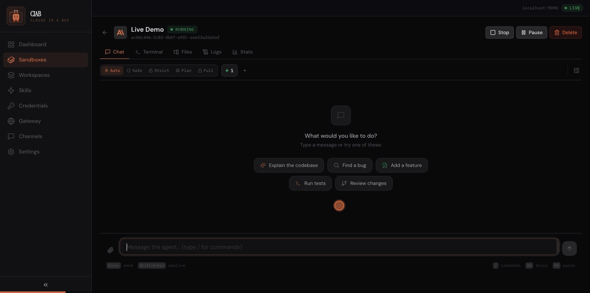
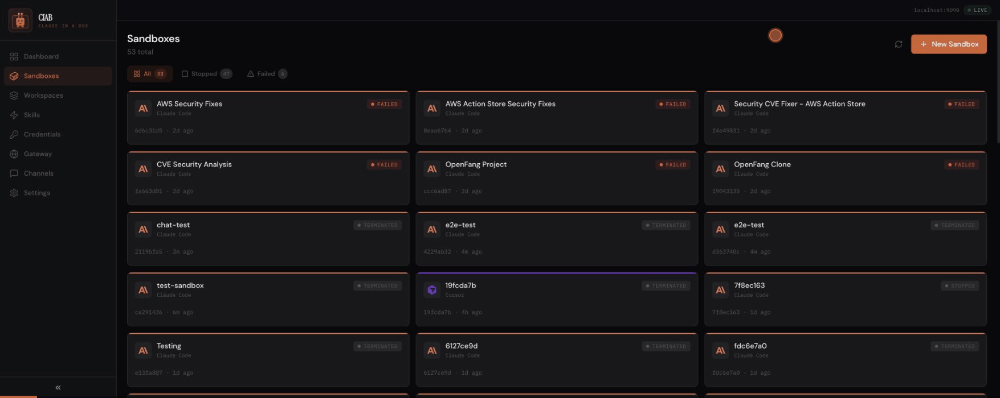
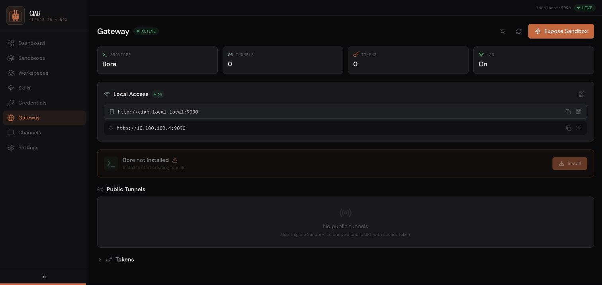

<p align="center">
  
</p>

<p align="center">
  <b>Run, orchestrate, and stream coding agents — from a single control plane.</b>
</p>

<p align="center">
  <a href="https://github.com/shakedaskayo/ciab/actions/workflows/ci.yml"></a>
  <a href="https://github.com/shakedaskayo/ciab/releases/latest"></a>
  <a href="https://github.com/shakedaskayo/ciab/blob/main/LICENSE"></a>
  <a href="https://shakedaskayo.github.io/ciab"></a>
</p>

<br>

CIAB (**Claude-In-A-Box**) is an open-source control plane for coding agents. Spin up **Claude Code**, **Codex**, **Gemini CLI**, or **Cursor** in isolated sandboxes — as local processes or containers — and manage them all through a unified REST API, CLI, or desktop app.

Each sandbox gets its own workspace, credentials, repos, and streaming output. You control everything from one place.

```bash
curl -fsSL https://raw.githubusercontent.com/shakedaskayo/ciab/main/install.sh | bash
```

<br>

## Live Streaming Chat

Chat with coding agents in real time — watch text stream in, tool calls execute, and results appear as they happen. Full SSE streaming from agent to browser.

<p align="center">
  
</p>

<br>

## Desktop App

Visual management for all your sandboxes, workspaces, skills, credentials, and gateway tunnels.

<p align="center">
  
</p>

<br>

## Mobile Access — Chat From Anywhere

CIAB's built-in gateway lets you access your sandboxes from **any device** — iPhone, iPad, Android, or any browser. Scan the QR code from the Gateway page to open the web UI on your phone. Full streaming chat works on mobile with the same real-time experience.

<p align="center">
  
</p>

**How it works:**

1. Start the CIAB server on your machine
2. Open the **Gateway** page in the desktop app
3. Scan the **QR code** with your phone (same WiFi network)
4. Chat with your agents from your phone with full streaming support

For remote access outside your network, enable a tunnel (bore, Cloudflare, ngrok, or frp) to get a public URL — accessible from anywhere in the world.

<br>

## How It Works

<p align="center">
  
</p>

**Clients** (CLI, REST API, desktop app, mobile, Slack/WhatsApp) connect to the **CIAB control plane** — an Axum-based gateway that handles auth, streaming, and orchestration. The control plane provisions sandboxes through a **9-step pipeline** (validate → prepare → create → start → mount → inject credentials → clone repos → run scripts → launch agent), streaming every step over **SSE** in real time. Each sandbox runs an isolated coding agent backed by its provider's API.

<br>

## Quick Start

```bash
# Install
curl -fsSL https://raw.githubusercontent.com/shakedaskayo/ciab/main/install.sh | bash

# Initialize and start
ciab config init
ciab server start

# Create a sandbox with Claude Code
ciab sandbox create --provider claude-code \
  --env ANTHROPIC_API_KEY=$ANTHROPIC_API_KEY

# Stream a conversation
ciab agent chat <sandbox-id> --message "Refactor the auth module" --stream
```

<br>

## Why CIAB?

| | What you get |
|---|---|
| **Multi-agent** | Run Claude Code, Codex, Gemini CLI, and Cursor side-by-side. Switch providers with one config change. |
| **Isolated sandboxes** | Each agent gets its own workspace, env vars, credentials, and mounted repos. Local processes or containers. |
| **Real-time streaming** | Watch agent output as it happens — text deltas, tool use, provisioning steps, logs — all over SSE. |
| **Mobile access** | Scan a QR code to chat with agents from your iPhone, iPad, or any device. Full streaming on mobile. |
| **Workspaces** | Reusable, TOML-configurable environment definitions. Bundle repos, skills, pre-commands, binaries, and agent config. |
| **Encrypted credentials** | AES-256-GCM vault with OAuth2 support. Credentials injected at provisioning time, never stored in plaintext. |
| **Remote access** | Expose sandboxes via bore, Cloudflare Tunnel, ngrok, or frp. Token-scoped auth with LAN discovery. |
| **Channels** | Pipe agent conversations through Slack, WhatsApp, or webhooks. Per-sender session tracking. |
| **Desktop + Web app** | Tauri + React visual management — create sandboxes, watch streams, manage workspaces. Accessible via browser on any device. |

<br>

## Access Methods

```bash
# CLI
ciab sandbox create --provider claude-code
ciab agent chat <id> --message "Fix the bug" --stream

# REST API
curl -X POST http://localhost:9090/api/v1/sandboxes \
  -H "Content-Type: application/json" \
  -d '{"agent_provider": "claude-code", "env_vars": {"ANTHROPIC_API_KEY": "..."}}'

# SSE streaming
curl -N http://localhost:9090/api/v1/sandboxes/<id>/stream

# Desktop app
make desktop

# Mobile — scan QR from Gateway page or open http://<your-ip>:9090
```

<br>

## Workspaces

Define reusable environments in TOML — repos, skills, credentials, agent config — and launch them with one command:

```toml
[workspace]
name = "my-project"
provider = "claude-code"

[[repositories]]
url = "https://github.com/org/repo.git"
branch = "main"
path = "/workspace/repo"

[[pre_commands]]
command = "npm install"
working_dir = "/workspace/repo"

[agent_config]
model = "claude-sonnet-4-20250514"
system_prompt = "You are a senior engineer working on this project."

[[credentials]]
env_var = "ANTHROPIC_API_KEY"
vault_path = "anthropic/api-key"
```

```bash
ciab workspace import workspace.toml
ciab workspace launch <workspace-id>
```

<br>

## Architecture

```
crates/
  ciab-core             Types, traits, errors (foundation)
  ciab-api              Axum REST API — 15 route groups
  ciab-sandbox          Runtime backends: local process, Docker, OpenSandbox
  ciab-streaming        SSE broker with event buffer and replay
  ciab-provisioning     9-step sandbox provisioning pipeline
  ciab-credentials      AES-256-GCM encrypted vault, OAuth2
  ciab-gateway          Remote tunneling (bore, Cloudflare, ngrok, frp) + LAN discovery
  ciab-channels         Slack, WhatsApp, webhook adapters
  ciab-agent-claude     Claude Code provider
  ciab-agent-codex      Codex provider
  ciab-agent-gemini     Gemini CLI provider
  ciab-agent-cursor     Cursor provider
  ciab-db               SQLite persistence (sqlx)
desktop/                Tauri v2 + React desktop app
docs/                   MkDocs Material documentation
```

<br>

## Install

**One-liner** (macOS & Linux):

```bash
curl -fsSL https://raw.githubusercontent.com/shakedaskayo/ciab/main/install.sh | bash
```

**From releases** — download pre-built binaries:

| Platform | Download |
|----------|----------|
| macOS (Apple Silicon) | [`ciab-darwin-arm64.tar.gz`](https://github.com/shakedaskayo/ciab/releases/latest) |
| macOS (Intel) | [`ciab-darwin-x64.tar.gz`](https://github.com/shakedaskayo/ciab/releases/latest) |
| Linux (x86_64) | [`ciab-linux-x64.tar.gz`](https://github.com/shakedaskayo/ciab/releases/latest) |
| Linux (ARM64) | [`ciab-linux-arm64.tar.gz`](https://github.com/shakedaskayo/ciab/releases/latest) |
| Desktop (macOS) | [`CIAB.dmg`](https://github.com/shakedaskayo/ciab/releases/latest) |

**From source:**

```bash
git clone https://github.com/shakedaskayo/ciab.git && cd ciab
cargo build --release
sudo cp target/release/ciab /usr/local/bin/
```

<br>

## Development

```bash
make build      # Build all crates
make test       # Run tests
make lint       # Clippy + warnings-as-errors
make server     # Start API server on :9090
make desktop    # Launch desktop app
make docs       # Serve docs at localhost:8000
make dev        # Server + desktop together
```

See [CONTRIBUTING.md](CONTRIBUTING.md) for full setup.

<br>

## License

[MIT](LICENSE)
