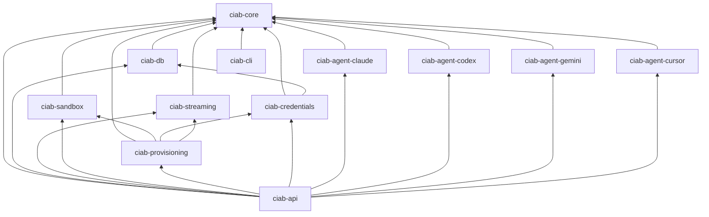

# Crate Map

CIAB consists of 12 Rust crates organized in a workspace.

## Crate Overview

| Crate | Purpose | Key Types |
|-------|---------|-----------|
| `ciab-core` | Foundation types, traits, errors | `SandboxInfo`, `Session`, `Message`, `StreamEvent`, `CiabError` |
| `ciab-db` | SQLite persistence via sqlx | `Database`, migrations |
| `ciab-streaming` | SSE broker and event buffering | `StreamBroker`, `EventBuffer` |
| `ciab-sandbox` | OpenSandbox container client | `SandboxRuntime`, lifecycle + execd APIs |
| `ciab-agent-claude` | Claude Code agent provider | `ClaudeProvider` |
| `ciab-agent-codex` | Codex agent provider | `CodexProvider` |
| `ciab-agent-gemini` | Gemini CLI agent provider | `GeminiProvider` |
| `ciab-agent-cursor` | Cursor agent provider | `CursorProvider` |
| `ciab-credentials` | Encrypted credential store | `CredentialStore`, AES-GCM encryption |
| `ciab-provisioning` | 9-step sandbox provisioning | `ProvisioningPipeline`, `ProvisioningStep` |
| `ciab-api` | Axum REST API server | Routes, handlers, middleware |
| `ciab-cli` | CLI binary (`ciab`) | Command definitions, HTTP client |

## Dependency Graph

## Core Types (`ciab-core`)

### Types (`ciab-core/src/types/`)

- **`sandbox.rs`** — `SandboxState`, `SandboxInfo`, `SandboxSpec`, `ResourceLimits`, `ResourceStats`, `ExecRequest`, `ExecResult`, `FileInfo`
- **`session.rs`** — `Session`, `SessionState`, `Message`, `MessageRole`, `MessageContent`
- **`stream.rs`** — `StreamEvent`, `StreamEventType`
- **`config.rs`** — `AppConfig`, `ServerConfig`, `AgentProviderConfig`
- **`credentials.rs`** — `CredentialSet`, `CredentialType`

### Traits (`ciab-core/src/traits/`)

- **`agent.rs`** — `AgentProvider` trait (10 methods)
- **`runtime.rs`** — `SandboxRuntime` trait
- **`stream.rs`** — `StreamHandler` trait
