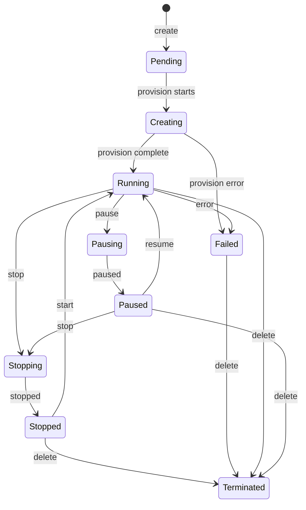

# Sandbox Lifecycle

Every sandbox follows a state machine with well-defined transitions.

## State Machine



## States

| State | Description |
|-------|-------------|
| **Pending** | Sandbox created but provisioning hasn't started |
| **Creating** | Provisioning pipeline is running |
| **Running** | Container is up, agent is ready |
| **Pausing** | Pause operation in progress |
| **Paused** | Container frozen, preserving state |
| **Stopping** | Stop operation in progress |
| **Stopped** | Container stopped, can be restarted |
| **Terminated** | Container deleted, irreversible |
| **Failed** | An error occurred, cleanup may be needed |

## Valid Actions by State

| State | Allowed Actions |
|-------|----------------|
| Running | `stop`, `pause`, `delete`, `exec`, `chat` |
| Paused | `resume`, `stop`, `delete` |
| Stopped | `start`, `delete` |
| Failed | `delete` |

!!! warning "Invalid State Transitions"
    Attempting an invalid action (e.g., `pause` on a `Stopped` sandbox) returns HTTP 409 with error code `sandbox_invalid_state`.

## Resource Monitoring

Running sandboxes report resource statistics:

```json
{
  "cpu_usage_percent": 23.5,
  "memory_used_mb": 512,
  "memory_limit_mb": 2048,
  "disk_used_mb": 150,
  "disk_limit_mb": 10240,
  "network_rx_bytes": 1048576,
  "network_tx_bytes": 524288
}
```

Stats are available via `GET /api/v1/sandboxes/{id}/stats` and streamed as `stats` events on the SSE stream.
