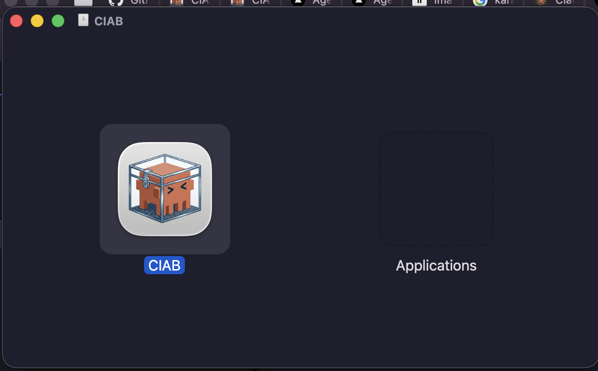

# Installation

## Quick Install (recommended)

Install the latest release with a single command:

=== "macOS / Linux"

    ```bash
    curl -fsSL https://raw.githubusercontent.com/shakedaskayo/ciab/main/install.sh | bash
    ```

=== "Specific version"

    ```bash
    curl -fsSL https://raw.githubusercontent.com/shakedaskayo/ciab/main/install.sh | bash -s -- --version v0.1.0
    ```

=== "Custom directory"

    ```bash
    curl -fsSL https://raw.githubusercontent.com/shakedaskayo/ciab/main/install.sh | bash -s -- --dir ~/.local/bin
    ```

This downloads the pre-built binary for your platform and places it in `/usr/local/bin`.

## Download from GitHub Releases

Pre-built binaries are available for every tagged release:

| Platform | Architecture | Artifact |
|----------|-------------|----------|
| macOS | Apple Silicon (M1+) | `ciab-darwin-arm64.tar.gz` |
| macOS | Intel | `ciab-darwin-x64.tar.gz` |
| Linux | x86_64 | `ciab-linux-x64.tar.gz` |
| Linux | ARM64 | `ciab-linux-arm64.tar.gz` |

Download from [GitHub Releases](https://github.com/shakedaskayo/ciab/releases/latest), extract, and move to your PATH:

```bash
tar xzf ciab-darwin-arm64.tar.gz
sudo mv ciab /usr/local/bin/
```

## Desktop App (macOS)

The CIAB desktop app provides a full GUI for managing sandboxes, workspaces, and agent sessions.

**1. Download** the `.dmg` file from [GitHub Releases](https://github.com/shakedaskayo/ciab/releases/latest).

**2. Open** the downloaded `.dmg` file. You'll see the CIAB app icon and an Applications folder shortcut:



**3. Drag** the CIAB icon into the **Applications** folder to install.

**4. Launch** CIAB from your Applications folder or Spotlight (`Cmd + Space`, type "CIAB").

!!! note "macOS Gatekeeper"
    On first launch, macOS may show a warning since the app is not signed with an Apple Developer certificate. To open it:

    1. Right-click (or Control-click) the app in Applications
    2. Select **Open** from the context menu
    3. Click **Open** in the dialog

    You only need to do this once — subsequent launches will work normally.

The desktop app includes a built-in CIAB server, so you don't need to run `ciab server start` separately.

## Build from Source

Requires [Rust](https://rustup.rs) (stable, latest).

```bash
git clone https://github.com/shakedaskayo/ciab.git
cd ciab
cargo build --release
```

The `ciab` binary will be at `target/release/ciab`.

```bash
# Install to PATH
sudo cp target/release/ciab /usr/local/bin/
```

## Verify Installation

```bash
ciab --version
ciab --help
```

## Initialize Configuration

Generate a default config file:

```bash
ciab config init
```

This creates `config.toml` in the current directory. See [Configuration](../configuration/index.md) for details on all settings.
