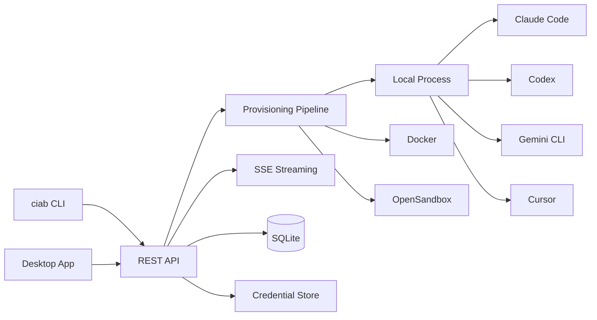

<div class="ciab-hero" markdown>


# Claude In A Box

<p class="tagline">Manage coding agent sandboxes with a single API</p>

[Get Started](getting-started/index.md){ .md-button .md-button--primary }
[API Reference](api-reference/index.md){ .md-button }

</div>

<div class="install-cmd" markdown>

```bash
curl -fsSL https://raw.githubusercontent.com/shakedaskayo/ciab/main/install.sh | bash
```

</div>

<div class="feature-grid" markdown>

<div class="feature-card" markdown>
### Multi-Agent Support
Run **Claude Code**, **Codex**, **Gemini CLI**, and **Cursor** side-by-side. Switch providers with a single config change.
</div>

<div class="feature-card" markdown>
### Flexible Runtimes
Run agents as **local processes**, in **Docker containers**, or in **OpenSandbox** with configurable resource limits and network policies.
</div>

<div class="feature-card" markdown>
### Real-time Streaming
Watch agent output as it happens via **Server-Sent Events**. Stream text deltas, tool use, provisioning steps, and logs.
</div>

<div class="feature-card" markdown>
### REST API + CLI + Desktop
Full **REST API** for programmatic control, a feature-complete **CLI**, and a **Tauri desktop app** for visual management.
</div>

</div>

---

## Quick Example

```bash
# Install CIAB
curl -fsSL https://raw.githubusercontent.com/shakedaskayo/ciab/main/install.sh | bash

# Initialize config
ciab config init

# Start the server
ciab server start

# Create a sandbox with Claude Code
ciab sandbox create --provider claude-code \
  --env ANTHROPIC_API_KEY=$ANTHROPIC_API_KEY \
  --name my-project

# Chat with the agent
ciab agent chat --sandbox-id <id> --message "Explain the codebase" --stream
```

## Architecture at a Glance


