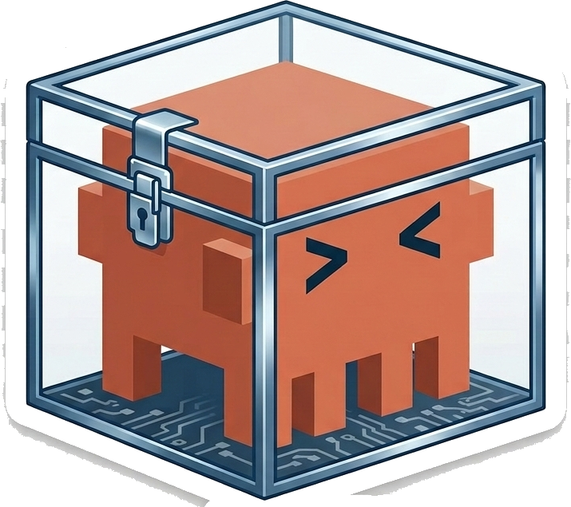
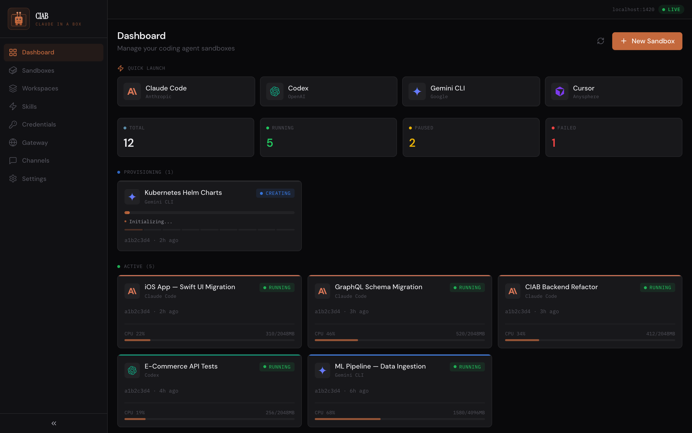
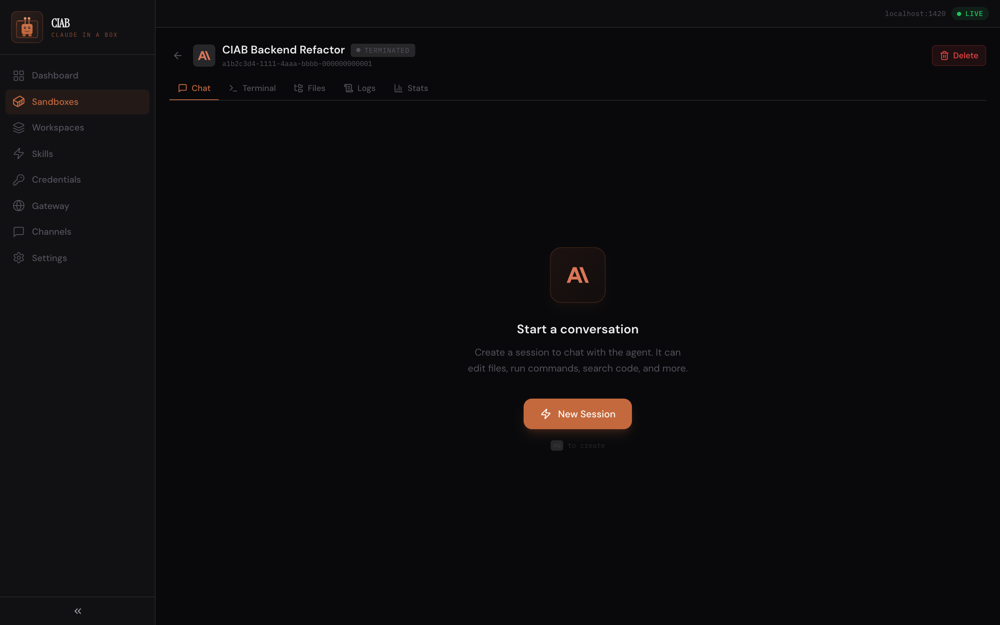
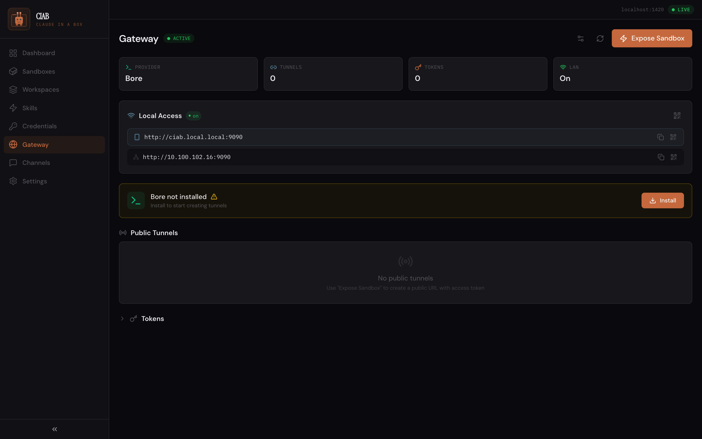
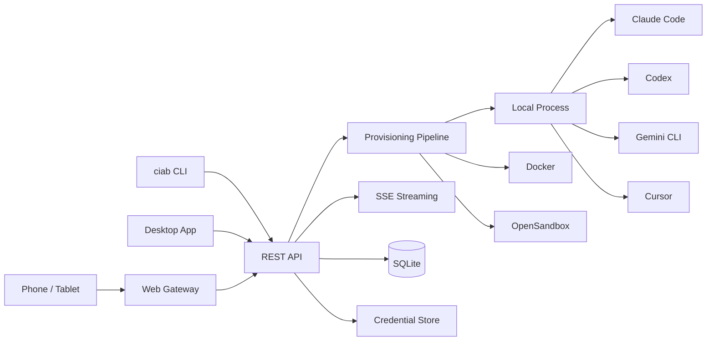

<div class="ciab-hero" markdown>



# Claude In A Box

<p class="tagline">Run, orchestrate, and stream coding agents — access them from anywhere.</p>

[Get Started](getting-started/index.md){ .md-button .md-button--primary }
[API Reference](api-reference/index.md){ .md-button }

</div>

<div class="install-cmd" markdown>

```bash
curl -fsSL https://raw.githubusercontent.com/shakedaskayo/ciab/main/install.sh | bash
```

</div>

---

## Dashboard

Manage all your coding agent sandboxes from a single control plane. Quick-launch Claude Code, Codex, Gemini CLI, or Cursor with one click.



---

## Chat with Agents — Real-time Streaming

Full conversation interface with live SSE streaming. Watch tool calls execute, file results appear, and code stream in — all in real time.



---

## Access From Anywhere — Phone, Tablet, Any Browser

CIAB's built-in **web gateway** makes every sandbox accessible from **any device on your network** — iPhone, iPad, Android, another laptop. Scan the QR code and start chatting. Enable a tunnel (bore, Cloudflare, ngrok) to access from anywhere in the world.



[Mobile Access Guide](deployment/mobile-access.md){ .md-button }

---

<div class="feature-grid" markdown>

<div class="feature-card" markdown>
### Multi-Agent Support
Run **Claude Code**, **Codex**, **Gemini CLI**, and **Cursor** side-by-side. Switch providers with a single config change.
</div>

<div class="feature-card" markdown>
### Access From Any Device
Open sandboxes from your **phone, tablet, or any browser** via the built-in web gateway. QR code scanning, mDNS, and public tunnels.
</div>

<div class="feature-card" markdown>
### Real-time Streaming
Watch agent output as it happens via **Server-Sent Events**. Stream text deltas, tool use, provisioning steps, and logs.
</div>

<div class="feature-card" markdown>
### REST API + CLI + Desktop + Web
Full **REST API**, feature-complete **CLI**, **Tauri desktop app**, and a responsive **web UI** accessible from any device.
</div>

</div>

---

## Quick Start

```bash
# Install (one-liner)
curl -fsSL https://raw.githubusercontent.com/shakedaskayo/ciab/main/install.sh | bash

# Initialize config and start
ciab config init
ciab server start

# Create a sandbox with Claude Code
ciab sandbox create --provider claude-code \
  --env ANTHROPIC_API_KEY=$ANTHROPIC_API_KEY

# Chat with the agent
ciab agent chat <sandbox-id> --message "Explain the codebase" --stream

# Access from your phone — open http://<your-ip>:9090 or scan QR from Gateway page
```

## Architecture at a Glance


